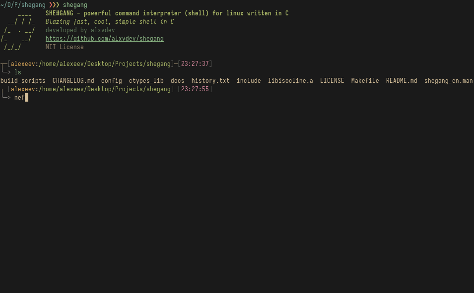

# shegang

<p align="center">Powerful command interpreter (shell) for linux written in C.</p>
<br>
<p align="center">
    
    
    
    
    
    </br>
</p>

Blazing fast, super simple and indestructible program interpretator (shell) in C language. `she#gang` is a feature-rich, customizable shell that aims to provide an enhanced user experience for command-line interactions. Inspired by popular shells like bash, zsh and fish, shegang offers a variety of advanced features to streamline your workflow and boost productivity.



> [!CAUTION]
> __shegang currently only supports Linux® distributions.__ Other operating systems such as Windows, MacOS, BSD are not supported.

> [!NOTE]
> At the moment, shegang is under active development (alpha), many things may not work, and this version is not recommended for use (all at your own risk).

 > Current program state: Beta (0.10.30b)

*Stable Alpha Release*: [0.9.25alpha](https://github.com/alxvdev/shegang/releases/tag/0.9.25a)

You can see [commits changelog here](./CHANGELOG.md) or see [history of changes here](./docs/en/changes.md).

You can join to my [small russian telegram blog](https://t.me/hex_warehouse).

## Features
shegang comes packed with a wide range of features to enhance your command-line experience:

 - __Intuitive User Interface__: clean and modern interface with a focus on usability and readability.
 - __Command History__: extensive command history tracking with intuitive search and navigation.
 - __Process Management__: shegang uses posix rules to create and manage processes (background and foreground).
 - __Extensibility__: modular design allows for easy addition of new features and plugins.
 - __Customization__: comprehensive configuration opions in `~/.shegangrc` file to personalize the shell's appearance and behavior. And shegang have built-in function `shegang_config` for change configuration for current shell session.
 - __Commands analogues__: shegang has its own implementations of some default commands, you can see them in section "Usage".
 - __Autocomplete__: shegang has advanced smart autocomplete that allows you to best experience.
 - __Syntax Highlight__: shegang has advanced syntax highlighting, which allows you to improve your work in shell.
 - __Fuzzy Searching__: fuzzy finding allows you to quickly understand where you made a mistake in the command.
 - __Aliases__: shegang have been functionality for create aliases and use it in shell.
 - __Colorschemes__: shegang have custom color schemes for syntax highlight (you can see in section "usage")
 - __Plugin system__: shegang have plugin manager, plugin loader and example of plugins for shell. Plugins writen in C and compiled to .so files (and load to shegang)
 - __Environment variables__: shegang can set or get value of environment variable with `environment` util.
 - __Delimiters__: shegang can split line by delims (&&, &, ||, |, ;)

## Planned Features
Me and shegang community is constantly working to improve and expand the shell's capabilities. Some of the planned features include:

1. *Configuration Management*
2. *Scripting support*
3. *Functions management*
4. *Comprehensive customization*
5. *Productivity-enhancing tools*
6. *Integrated minimalistic text editor like nano or vi*
7. *Pipes (>, >>) for redirect command output*

### Known uncorrected bugs
Unfortunately, shegang has bugs that can interfere with the user experience. Below we have placed a list of known bugs that have not been fixed. You can submit bug solution.

 > There are no known bugs

## Documentation
This project have [manual file](./shegang_en.man): `man ./shegang_en.man`.

And this project have [russian docs / документация на русском](./docs/ru/index.md) and [english docs](./docs/en/index.md).

You can create translation of docs for another languages.

## Building
Shegang use [isocline library](https://github.com/daanx/isocline) for read user input, autocomplete and syntax highlight. Library compiled [here](./libisocline.a).

Install make and clang compiler.

```bash
sudo apt install make clang readline-devel # Debian/Ubuntu
sudo pacman -S make clang readline # Arch/Manjaro
sudo dnf install make clang readline-devel # Fedora
```

And run building:

```bash
make build install clean
```

Binary file saved in /usr/local/bin/shegang and you can call `shegang` command.

## Building for ctypes (Python)

Install make and clang compiler.

```bash
sudo apt install make clang readline-devel python3 # Debian/Ubuntu
sudo pacman -S make clang readline python3 # Arch/Manjaro
sudo dnf install make clang readline-devel python3 # Fedora
```

And run building:

```bash
make ctypes
```

You can view `libshegang.so` in `ctypes_lib/bin` and view example of usage at the `ctypes_lib/shegang.py`.

## Building example plugin.

Install make and clang compiler.

```bash
sudo apt install make clang readline-devel python3 # Debian/Ubuntu
sudo pacman -S make clang readline python3 # Arch/Manjaro
sudo dnf install make clang readline-devel python3 # Fedora
```

And run building:

```bash
make example_plugin
```

You can view `example_plugin.so` in root directory.

## Usage

### Navigating the shell

 - Use the arrow keys to navigate through the command history.
 - Press the `Tab` key for automatic command and file path completion
 - Clear the current line by pressing Ctrl+C
 - Exit the shell by typing exit or quit

### Configuration
shegang allows you to customize various aspects of the shell by editing the configuraion file located at `~/.shegangrc`. This file supports the following settings:

 - `USERNAME_COLOR`: uppercase color name for username in shell prompt (red, yellow, blue, green, magenta, cyan, black, white, gray).
 - `PWD_COLOR`: uppercase color name for current working directory in shell prompt (red, yellow, blue, green, magenta, cyan, black, white, gray)
 - `TIME_COLOR`: uppercase color name for current time in shell prompt (red, yellow, blue, green, magenta, cyan, black, white, gray)
 - `COLORSCHEME`: lowercase color scheme name (gruvbox, onedark)

If the configuration file is not found or the settings are not present, the shell will use the following default values:

 - `USERNAME_COLOR`: `YELLOW`
 - `PWD_COLOR`: `GREEN`
 - `TIME_COLOR`: `MAGENTA`
 - `COLORSCHEME`: `gruvbox`

To modify the configuration, simply edit the `~/.shegangrc` file and add or update the desired settings. The changes will take effect the next time you start the `shegang` shell or run `reload` in shegang.

Or you can use built-in util `shegang_config` for configurate variables for current shell session (dont saved to config):

```bash
$ shegang_config set <VAR> <VALUE>

# Supported vars:
# USERNAME_COLOR; PWD_COLOR; TIME_COLOR; COLORSCHEME
# Supported values:
# RED, GREEN, BLUE, YELLOW, MAGENTA, GRAY, BLACK, WHITE, CYAN
# for COLORSCHEME: gruvbox, onedark
```

#### Aliases
shegang has the ability to create its own aliases. To do this, create a file ~/.sgaliases and add aliases using the following template:

```bash
ls=sgls
```

In this example we have alias `ls`.

### Built-in command analogues
Shegang has its own implementations of some default commands, you can see them in the section.

#### sgls
`sgls` - is a `ls` command analogue, but sgls have colored output and nerd icons.

> [!NOTE]
> sgls need [nerd icons font](https://www.nerdfonts.com/font-downloads) for display icons.

```bash
-t             Show time
-a             Show hidden
-l             Show as list
-p             Show permissions
```

#### sglsblk
`sglsblk` - is a `lsblk` command simple analogue. Just run `sglsblk`.

#### gapf
`gapf` - is a `cat` command simple analogue with info about file. Just run `gapf <FILENAME>`.

#### Plugin System
For load example file, run command: `shegang path/to/plugin.so`. If is loaded without errors - use shegang with plugin.

Example plugin:

```c
/**
 * Example plugin for Shegang shell
 * by alxvdev
 */
#include <stdio.h>
#include <stdlib.h>

// Metadata
typedef struct {
    char* name;
    char* description;
    char* author;
    char* license;
} plugin_metadata_t;

// Init - before shell mainloop
int plugin_init(void) {
    printf("Example plugin has been initialized\n");
    return 1;
}

/**
 * @brief      Work with user input in shell mainloop
 *
 * @param      input  The input
 *
 * @return     status code
 */
int plugin_mainloop(char* input) {
    printf("Example plugin: %s\n", input);

    return 1;
}

// Deinit - after exit from shell
int plugin_deinit(void) {
    printf("Deinitialize example plugin\n");

    return 1;
}

// Get plugin metadata;
void get_plugin_metadata(plugin_metadata_t* metadata) {
    metadata->name = "Example plugin";
    metadata->description = "This is example of plugin for shegang";
    metadata->author = "Alexeev Bronislav";
    metadata->license = "MIT License";
}
```

Plugin loading: `shegang path/to/plugin.so`.

Compile [example plugin](./plugins/example_plugin.c): `make example_plugin`

#### environment
For get and set value for environment variable use built-in util `environment`:

```bash
environment set VAR1 TEXT
environment get VAR1 # TEXT
environment get USER # <your username>
```

## Functional
Here you can see what shegang can already do and what else is planned to be added in the future:

 - [x] Autocompleting
 - [x] `ls` command analogue
 - [x] `lsblk` command analogue
 - [x] `cat` command analogue
 - [x] Aliases
 - [x] Syntax highlighting
 - [x] Fuzzy finding
 - [x] Base customization
 - [x] Fix bug with grid view in `sgls`
 - [x] Custom colorschemes for syntax highlight
 - [x] Plugin System
 - [x] Environment variables
 - [ ] Shegang Integrated Minimalistic Editor for Linux (SIMEL)
 - [ ] Improve configuration
 - [ ] Improve shell prompt customization


## Base Project Structure

You can view full project structure at [en docs - project architecture](./docs/en/project_architecture.md) or [ru docs - архитектура проекта](./docs/en/project_architecture.md)

 + `colors.c` - module for coloring output (`colors.h`) and display PS
 + `shegang.c`- main source file
 + `tasks_processing.c` - module for work with tasks and processes (`tasks_processing.h`)
 + `userinput.c` - module for work with user input (`userinput.h`)
 + `executor.c` - built-in functions for sheadd_background_task (`executor.h`)
 + `config.c` - module for load config file (`config.h`)

## Contact and support
If you have questions about using shegang, then create an [issue](https://github.com/alxvdev/shegang/issues/new) in the repository or write to me at bro.alexeev@inbox.ru.

You can also write to me on Telegram: [@alexeev_dev](https://t.me/alexeev_dev)

SHEGANG is an Open Source project, and it only survives due to your feedback and support!

Project releases are available at [this link](https://github.com/alxvdev/shegang/releases).

## Copyright
shegang is released under the [MIT License](LICENSE). Feel free to use, modify and distribute the code as per the terms of license.

Copyright © 2024 Alexeev Bronislav. All rights reversed.

The registered trademark Linux® is used pursuant to a sublicense from LMI, the exclusive licensee of Linus Torvalds, owner of the mark on a world-wide basis.

